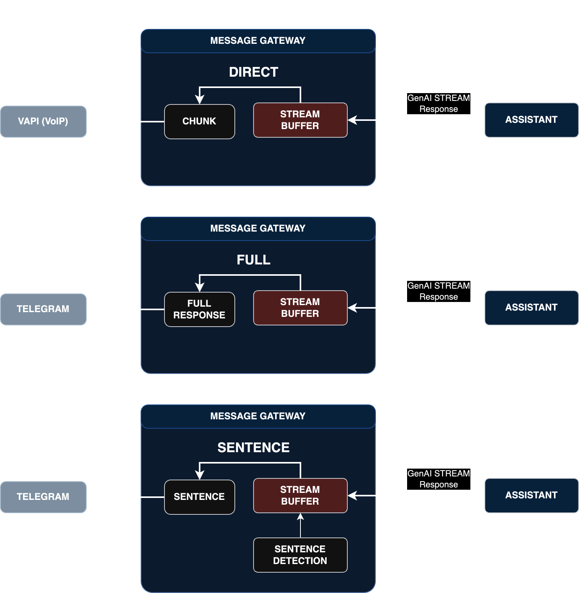

# Stream Modes

Cel.ai supports different stream modes to define how the client, through the connector, receives responses from the AI assistant. These modes are designed to optimize the user experience based on the specific requirements of the platform and the nature of the interaction. Below are the available stream modes:

  

## Stream Modes

### 1. DIRECT
In the DIRECT mode, each chunk of text generated by the LLM (Large Language Model) is immediately sent to the connector. This mode is ideal for scenarios where real-time response generation is crucial, such as in Text-to-Speech (TTS) applications.

- **Use Case**: Real-time TTS generation.
- **Behavior**: Sends each chunk of text as soon as it is generated by the LLM.
- **Advantages**: Immediate feedback, suitable for real-time applications.

### 2. SENTENCE
The SENTENCE mode allows the construction of paragraphs or sentences before sending them to the connector. This mode is particularly useful for messaging platforms where responses can be lengthy. It enables the user to start receiving parts of the response without waiting for the entire response to be generated by the LLM, thus improving response times and user experience.

- **Use Case**: Messaging platforms with potentially lengthy responses.
- **Behavior**: Sends paragraphs or sentences as they are constructed.
- **Advantages**: Improved response times, better user experience for lengthy messages.

### 3. FULL
In the FULL mode, the response is sent to the connector only after the LLM has completed the entire inference process. This mode is ideal for use with Message Enhancers, where the complete response needs to be processed or enhanced before being delivered to the user.

- **Use Case**: Scenarios requiring complete response processing, such as with Message Enhancers.
- **Behavior**: Sends the complete response after the LLM has finished generating it.
- **Advantages**: Ensures the response is fully processed or enhanced before delivery.

## Summary

| Stream Mode | Use Case | Behavior | Advantages |
|-------------|----------|----------|------------|
| DIRECT      | Real-time TTS generation | Sends each chunk of text immediately | Immediate feedback, real-time applications |
| SENTENCE    | Messaging platforms with lengthy responses | Sends paragraphs or sentences as they are constructed | Improved response times, better UX for lengthy messages |
| FULL        | Scenarios requiring complete response processing | Sends the complete response after full generation | Ensures fully processed or enhanced responses |

By selecting the appropriate stream mode, developers can tailor the behavior of their AI assistants to best fit the needs of their specific application and platform, ensuring optimal performance and user satisfaction.